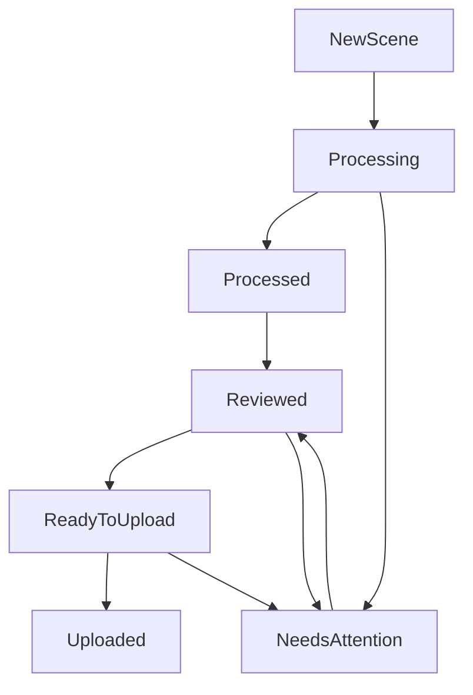

# Workflow Map From Tutorial Videos

This map is derived from sampled keyframes extracted from operator tutorial recordings in `data/tutorial_keyframes/`.
It captures the real execution flow the UI and backend should support.

## Source videos + extraction sets

- `JMac_Content Uploading to AEBN.mov` -> `data/tutorial_keyframes/aebn_upload/` (14 frames)
- `Screen Recording_Content Processing 1_ 2025-10-24 at 12.47.05 PM.mov` -> `data/tutorial_keyframes/content_processing_1/` (32 frames)
- `Video Tutorial_BlondeHexe_Cover Creation.mov` -> `data/tutorial_keyframes/cover_creation/` (9 frames)
- `JMAC Content Processing.mov` -> `data/tutorial_keyframes/jmac_processing/` (17 frames)
- `Naughty America_Delivery to ADE using MultCloud.mov` -> `data/tutorial_keyframes/ade_delivery/` (16 frames)

## End-to-end workflow (actor/action/tool/input/output/error)

| Step | Actor | Action | Tool/UI | Inputs | Outputs | Common failure modes |
|---|---|---|---|---|---|---|
| 1 | Operator | Stage source assets | Finder + shared drive | Scene videos, covers, docs | Organized scene folders | Missing files, inconsistent naming |
| 2 | Operator | Track queue and metadata | Google Sheets tracker | Scene IDs, performers, genres, statuses | Per-scene progress state | Missing columns, stale status |
| 3 | Operator | Process scenes and generate covers | AMG pipeline (`amg process`) | Video path + local model | Contact sheet + candidate covers + decision log | Slow/timeout runs, weak cover diversity |
| 4 | Operator | Manual cover composition | Photoshop template workflow | Selected thumbnails + template | Final human-authored cover artwork | Text overlap, crop issues, bad hero frame |
| 5 | Operator | Validate/adjust metadata and title | Spreadsheet + platform forms | Title, description, tags, performers | Platform-ready metadata rows | Title length mismatch, bad categorization |
| 6 | Operator | Prepare compliance docs | Local docs + tracker | 2257 + IDs + release docs | Scene-level compliance package | Missing performer release, missing 2257 |
| 7 | Operator | Upload to AEBN | AEBN web form | Scene metadata + covers + video + docs | Draft/published AEBN listing | Form validation errors, upload failures |
| 8 | Operator | Deliver to ADE via transfer workflow | MultCloud/Drive transfer flow | Encoded videos + docs + metadata | Delivered package for ADE | Transfer auth failures, partial upload |
| 9 | Operator | Final status update | Google Sheets tracker | Platform outcomes | Uploaded/completed status | Drift between reality and tracker |

## Visual evidence notes from extracted keyframes

- `aebn_upload/frame_0001.jpg`, `frame_0007.jpg`, `frame_0014.jpg` show side-by-side work:
  - AEBN form filling, Finder asset curation, and tracker spreadsheet updates in parallel.
- `content_processing_1/frame_0016.jpg` shows thumbnail-generation tooling in use while tracker and file browser stay open.
- `cover_creation/frame_0005.jpg`, `frame_0009.jpg` show PSD/template based manual cover layout and text-safe crop adjustments.
- `ade_delivery/frame_0001.jpg`, `frame_0008.jpg`, `frame_0016.jpg` show cloud-transfer delivery and destination folder verification.

## Required state machine for the UI

## Non-negotiable UX constraints

- Manual approvals remain explicit at every platform submission step.
- Classifications must be inspectable and correctable by the operator.
- Tracker-visible status changes should be auditable and reversible.
- Missing compliance docs must hard-block "ready/uploaded" transitions.
